# ClaudeStatus

A tiny tray app that shows your current Claude subscription usage at a glance:
the 5-hour session window, the weekly all-models window, and the weekly Fable
window.

<p align="center">
  
</p>

The number lives in the tray icon itself, so the answer to "do I have enough
session left to start this?" is already on screen. Click it for the detail.

> **Looking for the detail?** [`docs/manual.md`](docs/manual.md) is the full
> handbook — how it works, every setting, building, packaging, the rules the code
> follows, and troubleshooting.

---

## Install

**Windows 10/11** — download `ClaudeStatus-win-Setup.exe` from the
[latest release](https://github.com/FrancMunoz/claude-status/releases/latest) and
run it. It installs per-user, needs no administrator rights, and updates itself.

> The installer is code-signed, but SmartScreen may still warn the first time
> until the signature builds reputation: **More info → Run anyway**. See
> [signing](docs/releasing.md#signing).

A `ClaudeStatus-win-Portable.zip` is also published for anyone who would rather
not install anything. It does not update itself.

**macOS 13+ (Apple Silicon)** — download `ClaudeStatus-osx-Setup.pkg` from the
[latest release](https://github.com/FrancMunoz/claude-status/releases/latest) and
open it. It installs to `/Applications`, needs no administrator rights, and
updates itself.

> The installer is **signed with a Developer ID certificate and notarised by
> Apple**, so it opens normally — no Gatekeeper bypass, no right-click → Open.

A `ClaudeStatus-osx-Portable.zip` is also published. It does not update itself.
Intel Macs are not packaged yet: the build is `osx-arm64` only.

**Linux** is supported in the code and is not packaged. The platform layer exists
behind interfaces and CI builds and tests it on every push, but nothing is
published for it.

## Using it

The icon shows one metric — session % by default — as a bare number. It turns
**red** past your threshold (80 % by default), fades when the reading is out of
date, and swaps the number for a shape when there is no number to show: `!` no
credential, `✕` exhausted, `⊘` never reached the endpoint.

### Menu bar — macOS only

macOS does not get an icon at all. It gets a real `NSStatusItem` that writes every
limit across the menu bar as text, which the system draws in its own font and its
own colour — so it follows dark and light mode, and the menu bar's own tint over a
dark desktop picture, with nothing to keep in sync:

<p align="center">
  
</p>

The session pair carries the time left in the window with it — the `(2:36)`
above — the same countdown, in the same shape, as the taskbar widget's.

- **Left click** — the details popup, opened directly under the item.
- **Right click** — the menu.

That split is the reason for the native status item: Avalonia's tray icon hands
its menu *every* click, so a left click could never mean "show me the details".
The same layer is why the row can be wider than it is tall.

**Show Fable** in Config adds the weekly Fable limit as a third pair. There is no
Dock icon — the app is a menu bar utility and quits from its own menu.

### Taskbar widget — Windows only

On Windows the default indicator is not the icon but a small card in the taskbar
beside the clock, showing the session and weekly limits at once. Under each
percentage bar a second, fainter one fills with the window's own clock — how much
of the five hours or the seven days has gone — so a spend bar running ahead of
the time bar is the warning, without reading a single number. The session also
carries the time left as a small `(h:mm)` beside its label. Everything in
this section is Windows-only: macOS has the menu bar item above, and Linux uses
the tray icon.

It uses the same technique as [TrafficMonitor](https://github.com/zhongyang219/TrafficMonitor)
and, like it, relies on undocumented taskbar internals. If the taskbar cannot be
joined — vertical taskbar, or a Windows update that moves things — the app falls
back to the tray icon. **Config → Display** switches between the two, live, and
holds the options below.

| | |
| --- | --- |
| 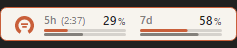 | **Themed card.** Your theme's colours, outlined in its accent. |
| 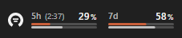 | **Blend into the taskbar** *(default)* — no card, and the clock's own text colour. |
| 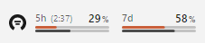 | The same blend on a **light taskbar**: the ink follows the taskbar, exactly as the tray icon's does. |
| 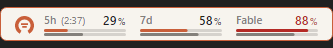 | **Show Fable** adds the weekly Fable limit as a third column. Off by default — most plans hit the session or weekly limit first. |

The widget is themed, so the card follows whichever theme you pick:

<p align="center">
  
  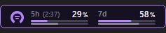
  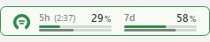
</p>

Hovering the widget opens a card with all three limits and their reset times,
whatever the widget itself is showing.

- **Left click** — the details popup. Click again to dismiss it.
- **Right click** — Details, Full report…, Show ▸ (switch metric), Refresh,
  Config…, Info, Quit.

| | |
| --- | --- |
| 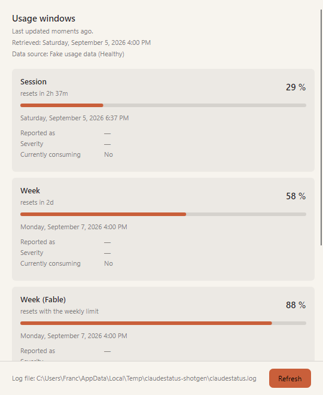 | 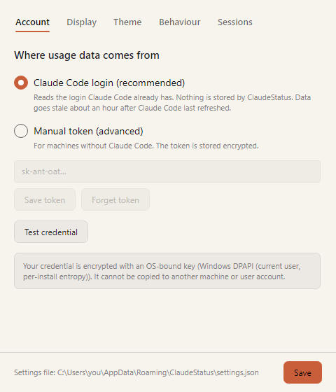 |
| **Full report** — every window the endpoint returned, its own severity labels, exact reset timestamps, and the spend and credit blocks. | **Config** — credential, language, theme, threshold, poll interval, autostart. |

### Languages

English, Spanish, Catalan, German and French, following your OS by default. A
sixth needs no rebuild — drop a translated JSON file into the config directory.
See [`docs/translating.md`](docs/translating.md).

### Themes

Eleven built in, plus your own from a file. **Claude** is the default; *Follow the
system* is one click away in the picker. Every one of them clears WCAG 4.5:1 on
body text; a palette that fails is not shipped.

<p align="center">
  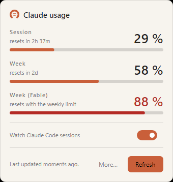
  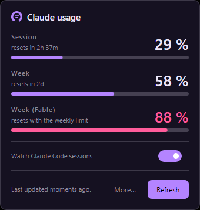
  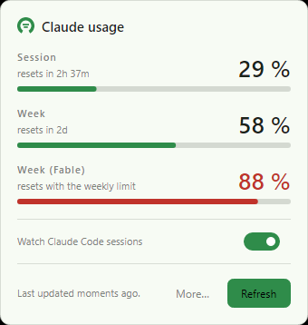
</p>

See [`docs/theming.md`](docs/theming.md).

## ⚠ Unofficial data source

Usage numbers come from `GET https://api.anthropic.com/api/oauth/usage` — the
same undocumented endpoint Claude Code's own `/usage` command calls. It is
**not a published API**. It can change or disappear without notice, and the
numbers may differ slightly from what claude.ai Settings → Usage shows at the
same instant.

This project is not affiliated with or endorsed by Anthropic.

See [`docs/data-source.md`](docs/data-source.md) for the full write-up.

## Security

ClaudeStatus is built so the credential is never the weak link:

- By default it **stores no token at all** — it reads Claude Code's existing
  login and writes nothing to disk. On macOS it holds that token in memory until
  it expires, so reading it need not cost a Keychain prompt on every poll.
- If you do paste a token manually (the "advanced" fallback), it is encrypted
  with an **OS-bound key**: DPAPI on Windows, the Keychain on macOS, libsecret
  on Linux. A copied config folder is useless on another machine or user account.
- The only host it ever talks to about your usage is `api.anthropic.com`, over
  HTTPS with default certificate validation. No telemetry, no diagnostics upload,
  no proxies.
- The one other request it makes is the update check against GitHub Releases,
  which sends nothing about you and can be switched off in Config → Behaviour.

Details and threat model: [`docs/security.md`](docs/security.md).

## Building from source

Requires the .NET 10 SDK.

```bash
dotnet build
dotnet test          # note: do NOT pass --nologo, it is forwarded to the test app
dotnet format --verify-no-changes
dotnet run --project src/ClaudeStatus.App
```

To build the installer — Windows on Windows, macOS on a Mac, because `vpk` shells
out to each platform's own packaging tools:

```pwsh
dotnet tool restore
./build/pack.ps1 -Version 0.1.0                      # win-x64, the default
./build/pack.ps1 -Version 0.1.0 -Runtime osx-arm64   # macOS .app and .pkg
```

See [`docs/releasing.md`](docs/releasing.md).

## Contributing

Commits follow [Conventional Commits](https://www.conventionalcommits.org/) —
they are what decides the next version number, so the prefix matters. Versions
are derived from git tags by MinVer; never edit a version by hand.

[`docs/manual.md`](docs/manual.md) is the full handbook: architecture, the rules
the code follows, packaging, and troubleshooting. Read §8 before opening a PR.

## Disclaimer

ClaudeStatus is an independent, unofficial side project. It is **not affiliated
with, authorised by, sponsored by or endorsed by Anthropic PBC**. "Claude",
"Anthropic" and "Fable" are trademarks of their respective owners and are used
here only to describe what the app reads.

The application icon, the installer, the macOS menu bar and the app itself use
our own mark — a gauge — and no third-party logo. The Claude mark was used for
this until 2026-09-07 and was removed; nothing in this repository claims any
rights in it.

The software is provided **"as is", without warranty of any kind**, express or
implied — the [licence](LICENSE) holds the binding wording. You use it entirely
at your own risk, and the author accepts **no liability** for any damage, data
loss, account problem or cost arising from its use.

In particular:

- The figures come from an **undocumented endpoint** (see above). They may be
  wrong, stale, or stop arriving altogether, and are not an authoritative record
  of your account — claude.ai → Settings → Usage is the number that counts.
- Nothing here promises availability, accuracy or fitness for any purpose, and
  no support or maintenance is owed.
- Reading your own usage is your own responsibility: access to that endpoint is
  subject to Anthropic's terms, and staying within them is on you.
- The Windows taskbar widget rides on **undocumented OS internals** and may break
  with any Windows update. It falls back to the tray icon when it can.
- Both installers are code-signed — Windows with Azure Artifact Signing, macOS
  with a Developer ID certificate and notarised by Apple. A signature says who
  built it, not that it is any good: check what you download either way and
  install it only if you are comfortable doing so.

## Licence

Released under the **[MIT Licence](LICENSE)** — Copyright © 2026 Franc
(ZeroWorks). You are free to use, copy, modify, distribute and sell it, including
commercially, as long as the copyright notice and the licence text travel with
the copy. MIT is also where the warranty and liability exclusions quoted in the
disclaimer above come from.

Built with [Avalonia UI](https://avaloniaui.net) (MIT) and packaged with
[Velopack](https://velopack.io) (MIT). Dependencies keep their own licences.

---

<p align="center">
  Made with ❤ in Menorca
</p>
