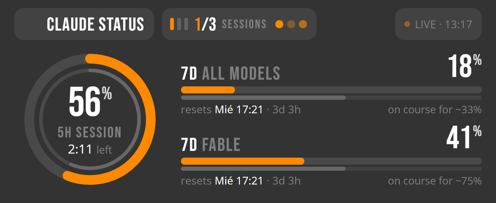

# The iCUE widget (CORSAIR XENEON EDGE)

ClaudeStatus can show the same reading as the taskbar widget on a CORSAIR
XENEON EDGE, through an iCUE widget. The widget is a small web page that iCUE
runs on the screen; it reads the numbers from ClaudeStatus over a local port.



## What it shows

In the **Small horizontal slot** (1/6 of the screen, 840×344):

- **The 5-hour session** as a ring. The outer arc is usage; the thin inner arc
  is how much of the 5 hours has elapsed. The number, the label and the time to
  the reset sit in the middle. When the word beside the countdown does not fit
  inside the ring ("restantes"), the time is shown alone.
- **The 7-day windows** (all models, and Fable when the plan has it) as rows:
  the name and the percentage on one line, the usage bar with the elapsed-time
  bar under it, and below them when the window resets (left) and where it is
  heading at this pace (right, "on course for ~33%").
- **Claude Code sessions**: one bar per open session, lit for a working one and
  grey for a waiting one, as tall as the digits of the `working/open` count
  beside them. Hidden when the session watch is off in ClaudeStatus.
- **The working wave**: three dots after the sessions count while any session
  has a turn in progress. It is the taskbar widget's sign, with the same
  motion: each dot fades up and down, a third of a beat behind the last.
- **Status boxes**, the same height as the pills: `LIVE` with the last fetch
  time; `STALE` in amber when the reading is old (the numbers fade too);
  `OFFLINE` when ClaudeStatus stopped answering and the widget is showing what
  it last saw; `PACE` when the velocity tracker has fired. The tracker's
  sentence appears as a banner while it holds, and the figures step down a size
  to make room for it.
- When the top row is too full, the sessions pill gives up its label, then its
  bars. The count and the wave always stay.
- A window at or over your threshold turns **red**, and a spent one shows **✕**,
  the way the tray icon does.

**Tap the widget** to open the details window on the PC, exactly as a click on
the tray icon does. With no credential it opens Config instead. When
ClaudeStatus is not running the widget says so and a tap opens the download
page in your browser.

## Setting it up

1. Install ClaudeStatus (Windows) and sign in to Claude Code, as usual.
2. In ClaudeStatus, open **Config → Behaviour** and turn on **Share the reading
   with the iCUE widget**. Leave the port at 47831 unless something else on the
   machine uses it.
3. Download `ClaudeUsage.icuewidget` from the
   [latest release](https://github.com/FrancMunoz/claude-status/releases/latest)
   and double-click it, or click **+** in iCUE's Widgets panel and pick it.
   iCUE 5.47 or later.
4. Drag **Claude Usage** onto a small slot of the XENEON EDGE.

**The port is 47831 on both sides and is best left alone.** The widget's
`manifest.json` declares it (`permissions: [{ "type": "url", "domain":
"localhost", "port": 47831 }]`), which is what makes iCUE show one permission
prompt rather than block silently. Changing the port in ClaudeStatus therefore
also means changing it in the widget's manifest and repackaging.

**How the widget talks to the app.** Over a WebSocket to the IPv6 loopback
address, `ws://[::1]:47831/v1/usage`. That is not a preference; it is the one
door iCUE leaves open. Measured on iCUE 5.51.40 (QtWebEngine 6.9.3, Chrome 130),
2026-09-27, from a widget page iCUE had initialised properly:

| Tried | Result |
|---|---|
| `http://` to `localhost`, `127.0.0.1` or `[::1]`, any fetch mode, XHR, script or image tag | refused in 2–8 ms, never reaches the app |
| `ws://localhost`, `ws://127.0.0.1`, `ws://127.1`, `ws://0.0.0.0` | closed 1006 in 2–5 ms, never reaches the app |
| **`ws://[::1]`**, `ws://[0:0:0:0:0:0:0:1]` | **opens**, from the first second |
| `ws://localhost.`, `ws://[::ffff:127.0.0.1]` | open, but only some seconds after load |
| `https://` to the internet | works |

The manifest's `url` permission for `localhost:47831`, approved by the user and
stored by iCUE, changes none of this; nor does declaring a newer framework
version. So the widget tries the spellings in turn, `[::1]` first, keeps the one
that opened, and falls back to plain HTTP last for a browser on the desk.
ClaudeStatus listens on both `127.0.0.1` and `[::1]` for that reason. **This
rests on iCUE's filter not matching the IPv6 literal**, which Corsair may change
in either direction; if a future iCUE honours the declared permission, the
`localhost` spellings start working and nothing here needs touching.

The socket is the better channel anyway: the app pushes a new document the
moment it has one, the widget never polls, and a tap sends one word back.

**Two behaviours of iCUE worth knowing**

- *For the first moments after a page loads, iCUE refuses all network*, the
  internet included. The widget's first attempt therefore often fails and the
  second succeeds; that is expected.
- *A widget imported while iCUE is running may load half-initialised.* iCUE
  logs `Unable to create new Profile, as another profile is using the same
  data path` and then `QWebChannel is not defined`, and the page gets no
  settings, no colours and no events until iCUE is restarted. It does not
  happen on every import, and not to someone installing the widget once. While
  developing: if Custom Style or the port stop responding after an import,
  quit iCUE from its tray icon and start it again.

**Colours and Custom Style.** The widget uses the colour variables exactly as
iCUE hands them over. With *Custom Style* on they are the user's; with it off
iCUE puts the widget's own declared defaults there (white text, `#FF8900`
accent, black at 80 %), as it does for every widget: Corsair's bundled ones
each declare their own, and there is no device-wide scheme. The red of a window
over its threshold, the amber of a stale reading and the grey of secondary text
are the widget's and do not follow the setting.

The widget's own settings in iCUE are the port (see above), whether to show
the Fable row, and the usual iCUE personalization: text, accent and background
colours and the background transparency. Its labels follow iCUE's language for English,
Spanish, German and French.

## What travels, and where

Nothing leaves the machine. ClaudeStatus listens on the loopback addresses only
(`127.0.0.1` and `[::1]`), and the
document it serves is percentages, reset times, the pace verdict, a session
*count* and its version. No token, no organisation id, no session titles. A web
page open on the same PC is refused (see `docs/security.md` §5b).

The widget makes one outbound link: the release page, and only when you tap it
while ClaudeStatus is not running.

## The contract

**WebSocket** (what the widget uses): connect to `ws://[::1]:<port>/v1/usage`
(or any other loopback spelling, from outside iCUE). The server sends the
current document as one text message on connect, and again every time it
changes (after each poll, session change and settings save). The client may
send:

- `open`, to have the details window shown;
- `log:<text>`, to write a line to ClaudeStatus's log. The device has no
  console, so this is how a widget says what state it is in. At most 40 lines
  per connection and 1024 bytes each, control characters removed, through the
  same redacting logger as everything else.

Anything else is ignored. The server pings idle sockets every 30 s.

**HTTP** (for a browser on the desk, and for anything that prefers to poll):
`GET http://localhost:<port>/v1/usage` answers the same JSON.

The document is camelCase with ISO-8601 times in UTC. Unknown fields are to be
tolerated; `schema` is bumped when a change would break a reader of the
previous shape.

```json
{
  "schema": 1,
  "state": "Ok",
  "appVersion": "1.4.0",
  "fetchedAt": "2026-09-26T08:04:12+00:00",
  "isStale": false,
  "thresholdPercent": 80,
  "windows": [
    { "id": "session",   "percent": 56, "resetsAt": "2026-09-26T10:15:00+00:00", "spanSeconds": 18000,  "exhausted": false },
    { "id": "week",      "percent": 18, "resetsAt": "2026-09-29T12:00:00+00:00", "spanSeconds": 604800, "exhausted": false },
    { "id": "weekFable", "percent": 41, "resetsAt": "2026-09-29T12:00:00+00:00", "spanSeconds": 604800, "exhausted": false }
  ],
  "pace": { "windowId": "session", "percentPerHour": 38, "runsOutAt": "…", "resetsAt": "…" },
  "sessions": { "working": 1, "open": 3 }
}
```

| Field | Meaning |
|---|---|
| `state` | `Ok`, `NoCredential` (the icon's `!`), `Unreachable` (`⊘`; `windows` may still carry the last reading), `NoData` (`—`). |
| `windows` | The indicators' order. `weekFable` is absent when the plan lacks it. `spanSeconds` is the window length, the one assumption the app makes about it. |
| `pace` | `null` while the pace is safe. Otherwise the window climbing too fast, the fitted rate, and the projected run-out and reset times. |
| `sessions` | `null` while the session watch is off. |

Other paths: `GET /v1/health` answers `{"ok":true}` as soon as the server is up;
`POST /v1/open` opens the details window; anything else is 404. Before the first
poll `/v1/usage` answers 503.

## Developing the widget

The source is `widgets/icue/ClaudeUsage/`: `index.html`, `styles/`, `scripts/`,
`translation.json`, `resources/`. It follows Corsair's widget conventions (their
bundled FPS and Sensor widgets are the reference: Bebas Neue Pro and Open Sans
from iCUE's own fonts, white on black at 80 %, the title pill, `--text-color`
/ `--accent-color` / `--background-color` so iCUE's *Custom Style* works).
`1rem` is 4.651 % of the slot height, which makes the 840×344 slot and its
314×129 settings preview the same layout.

Open `index.html` in a browser at 840×344 to work on it. `?mock=<state>` feeds
sample data instead of polling: `normal`, `hot`, `pace`, `stale`, `exhausted`,
`idle`, `noSessions`, `noCredential`, `unreachable`, `noData`, `appOffline`. In
iCUE's widget selector the preview shows the `normal` sample with a `PREVIEW`
chip.

### Four things that are not obvious

**Settings are read in the inline script.** iCUE hands a widget its settings
as script-level variables (`let textColor = …`), which are visible by name to
the inline script in `index.html` and are not properties of `window`. The
external script asks for them through `icueLocal(name)`, defined inline. The
handlers iCUE calls (`icueEvents`) are assigned inline too, which is also where
iCUE's validator looks for them.

**Text is aligned by its ink, in whole pixels.** Centring two sizes of a face by
their boxes does not put their letters level, and the panel draws glyphs on the
pixel grid, so a fraction of a pixel is lost in rounding. `alignInk` measures
where the baseline really is (an empty inline-block dropped into the element
sits on it), takes the ink height from the element's own characters, snaps both
to device pixels, and moves text by whole pixels: the title, the count and the
label onto one line, each percent sign to the top of its digits, the session
bars to the height of the digits. No font metric appears in the code. The CSS
property for this is `text-box-trim`; it needs Chrome 133 and iCUE 5.51 embeds
Chrome 130.

**Checking it on the device.** The XENEON EDGE is an ordinary 2560×720 monitor,
so it can be captured like one and measured by scanning pixel rows. That is the
check to trust: the widget's own geometry once reported "centred" while the
panel showed the label a pixel high. The widget writes one `ink …` line per
load with where it believes its top row landed, which is a starting point, not
proof.

**After importing, restart iCUE if settings stop responding.** See *Two
behaviours of iCUE* above. `Start-Process <file>.icuewidget` imports a package
into the running iCUE without a click, which makes a quick loop of edit,
package, import, read both logs.

### Packaging

Corsair's CLI validates and packs it:

```
npm install -g icuewidget-cli@0.4.47
icuewidget validate widgets/icue/ClaudeUsage
icuewidget package  widgets/icue/ClaudeUsage    # writes widgets/icue/claude-usage.icuewidget
```

`build.yml` runs both on every push and uploads the package as a workflow
artifact; `release.yml` packs it again and attaches it to the release as
`ClaudeUsage.icuewidget`. Bump `version` in `manifest.json` when the widget
itself changes; it is independent of the app's version.

## Troubleshooting

Two logs answer almost everything:

- **ClaudeStatus**: `claudestatus.log` in the config directory. Look for
  `Usage export listening on …`, `subscriber connected`, and `subscriber says:`
  (the widget's own lines).
- **iCUE**: `%LOCALAPPDATA%\Corsair\Logs\CUE5\<date>.log`. The widget's
  `console` output lands there as `js: ClaudeStatus widget: …`, including
  `socket open ws://…` and, after a failed round of attempts, a `state` line
  with what iCUE handed the page. iCUE's own script errors are there too.

Common cases:

- **"ClaudeStatus is not running"** with ClaudeStatus running: the setting is
  off, the ports differ, or the running ClaudeStatus is an older build without
  the export (autostart launches the installed one). Check Config → Behaviour,
  and `claudestatus.log` for `Usage export listening on …` or a warning that
  the port could not be bound.
- **Colours or settings do not respond** right after updating the widget:
  restart iCUE (see above).
- **Numbers faded with `STALE`**: the reading is older than the poll interval
  allows. The tray shows the same.
- **`OFFLINE`** after it worked: ClaudeStatus quit or the export was turned off.
  The widget keeps the last reading and says when it was taken.
- **Nothing happens on tap**: the widget must be on the device, not in iCUE's
  preview, and ClaudeStatus must be answering. The details popup opens on the
  PC's screen, near the tray.
